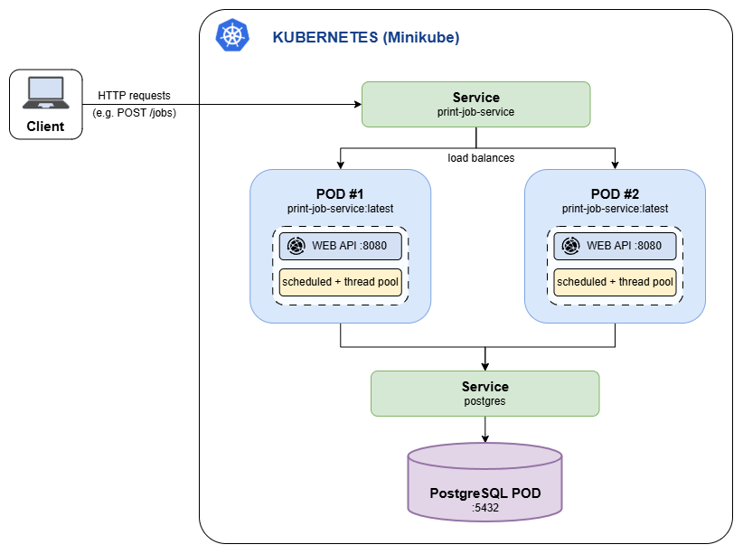

# Print/Render Service - Technical Interview

### Context

We run a rendering system. Clients submit a **render job** (a template id plus some parameters);
the job is processed **asynchronously**, and processing can occasionally fail transiently.
Clients poll for the job's status and fetch the result once it is done.

The set of available templates already exists (`RenderTemplate` / `GET /templates`) - you do not
need to build template management. Your job is to implement the render job lifecycle end to end,
**including how the service is packaged and run**.

### Prerequisites

- **JDK 25** installed locally (the Maven wrapper handles Maven itself, but you need a JDK to run
  `./mvnw` or your IDE).
- **Docker Desktop** (Mac/Windows) or **Docker Engine + the Compose plugin** (Linux), installed
  and running. Everything containerization-related in this exercise (the `Dockerfile` you're
  given, and the `docker-compose.yml` you write) is public/open-source - no account, license, or
  paid service is required. `docker compose version` should print a v2.x version.
- Ports **8080** (the app) and **5432** (Postgres) free on your machine, or be ready to remap them
  in your `docker-compose.yml` if something else is already using them.
- Git, to fork/push your solution.

### Functional Requirements

- **Submit a job**: `POST /jobs`
  - Body: `{ "templateId": "<uuid>", "parameters": { "any": "key-value data" } }`
  - Must return immediately (do not block the HTTP response on the actual rendering work).
  - Reject with `400` if `templateId` does not match an existing template.
  - On success, return `201` with the created job (id, status `QUEUED`, timestamps).

- **Process a job asynchronously**: once queued, a job must move through
  `QUEUED -> PROCESSING -> DONE` or `QUEUED -> PROCESSING -> FAILED`, driven by a background
  worker - not by an incoming HTTP request. "Rendering" can be simulated (e.g. a short delay);
  it does not need to produce a real document.
  - Some renders fail transiently. A failed attempt should be retried a bounded number of times
    before the job is marked `FAILED` with an error reason recorded.

- **Get job status**: `GET /jobs/{id}` - current status, attempt count, error message if failed,
  and whether a result is available.

- **List jobs**: `GET /jobs` - optionally filterable by status, e.g. `GET /jobs?status=FAILED`.

- **Fetch a result**: `GET /jobs/{id}/result` - returns the rendered output once the job is
  `DONE`. Decide yourself what should happen if it's called before the job finishes, or if the
  job failed.

### Required

- Your solution - code, commit messages, and README - must be in English.
- Java 25.
- This repo contains the existing project skeleton (template lookup, project setup, and a starter
  `Job` entity with the fields implied by the API contract above); fork or create a public
  repository with your solution. The `Job` entity does not model retry scheduling/backoff - that's
  part of what you're designing.
- You decide the scope of automated tests - we expect to see some.
  `RenderTemplateResourceTest` shows the MockMvc setup used in this repo, if that's a useful
  starting point.
- **The service must be containerized and runnable via Docker Compose alongside an actual
  PostgreSQL server** - i.e. a `postgres` Docker image running as its own container, not H2 or
  any other in-memory/embedded database. A `Dockerfile` for this service is provided; you need to
  write the `docker-compose.yml` that wires this app together with that `postgres` service (the
  app already reads its DB connection from `DB_HOST` / `DB_PORT` / `DB_NAME` / `DB_USER` /
  `DB_PASSWORD`, see `application.properties`). H2 is fine for your own test suite - it must not
  be what the running application connects to.
- The service must expose:
  - A liveness endpoint.
  - A readiness endpoint that reflects more than "the HTTP server is up" - think about what else
    a caller would want to know before considering this service ready to take traffic.
  - Some form of basic metrics (job counts by status is enough; format is up to you).
  - Paths for all three are up to you - just document them in your README so we know where to
    look.
- **Add a short "Design Decisions" section to your README** covering the points listed below
  under "A few things we deliberately left open." A few sentences per point is enough - this is
  the starting point for the design discussion, not a design doc.
- **Once the code is complete, reply to your hiring contact with a link to your repository.**

### A few things we deliberately left open

We're not going to tell you how to implement the queue/worker, the retry policy, or what your
readiness check should verify - that's for you to decide.


### Optional (not required to complete the exercise)

- Demonstrate that running two instances of your app against the same database does not cause a
  job to be processed twice.
- A Kubernetes `Deployment`/`Service` manifest for this app (it does not need to be applied to a
  real cluster - we're interested in the manifest itself, e.g. how you wire up probes).

### How to run

Building
```shell
$ ./mvnw compile
```

Test
```shell
$ ./mvnw test
```

Start the application (once you've written `docker-compose.yml`)
```shell
$ docker compose up --build
```

Listing available templates
```shell
$ curl localhost:8080/templates
```

## Design Decisions

### Queue / Worker

PostgreSQL is both the system of record and a durable queue: jobs are stored as `QUEUED` before the
API responds. A worker scheduled with `@Scheduled` polls at the interval configured by
`jobs.worker.poll-delay-ms` and dispatches jobs to a configurable `ThreadPoolTaskExecutor`. Jobs are
claimed transactionally with a pessimistic lock, preventing multiple application instances from
processing the same job; at a larger scale, a message broker would provide more efficient delivery
and back-pressure.

### Retry Policy

Each claim increments the attempt counter; success moves the job to `DONE`, while a transient
failure returns it to `QUEUED`. Retries are limited by `jobs.worker.max-attempts` (three by default),
after which the job is marked `FAILED` and the error reason is stored. Retries use the normal
polling interval; production workloads would benefit from exponential backoff and jitter.

### Readiness

`GET /health/readiness` verifies both database connectivity and that the background worker executor
is operational, since accepted jobs must be persisted and processed. It returns `200 OK` when both
checks pass or `503 Service Unavailable` with the failed component otherwise. Liveness is kept
separate so a temporary dependency failure stops traffic without restarting the application.

### Kubernetes

The optional Minikube setup runs two application replicas behind a Kubernetes Service and one
PostgreSQL instance backed by a persistent volume claim. Both application replicas share the same
database; the transactional locking described above prevents them from claiming the same job.
From the `scripts` directory, run `./start-minikube.sh` to deploy the stack and
`./stop-minikube.sh` to stop the local cluster.


